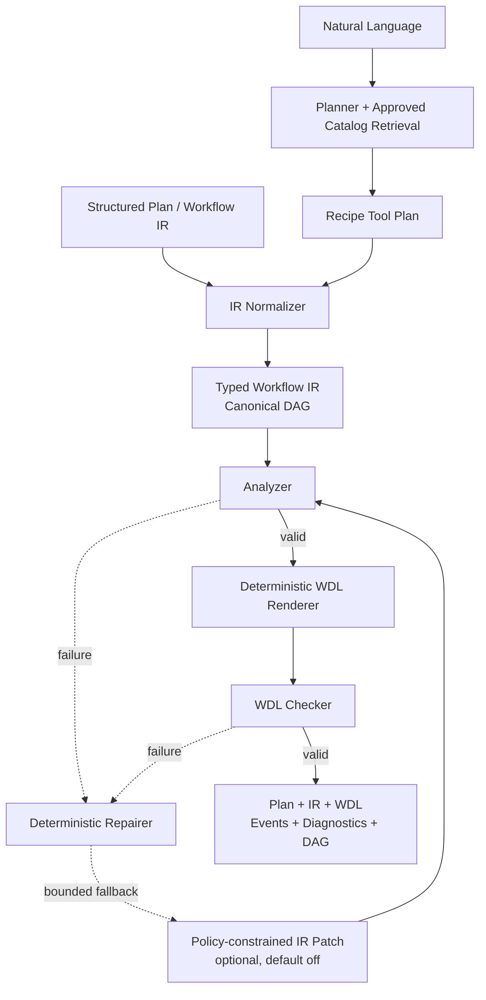

# AI-bioworkflow

**[中文](./README.md)** · [English](./README.en.md)

An auditable bioinformatics workflow compiler: natural-language or structured requirements become a Catalog-constrained Recipe Tool Plan and typed Workflow IR before deterministic WDL 1.0 generation and validation.

[Live RNA-seq example](https://yuanzhw.com/workspace?example=rnaseq-deg) · [RNA-seq evidence trail](./docs/rnaseq-case-study.md) · [Run history](https://yuanzhw.com/runs) · [Catalog](https://yuanzhw.com/catalog) · [API docs](https://yuanzhw.com/docs)

[](https://www.python.org/)
[](https://github.com/openwdl/wdl)
[](https://github.com/yuanzhw/AI-bioworkflow/actions/workflows/ci.yml)
[](./LICENSE)


## Why this project exists

Having a language model emit workflow source code is fast, but it makes tool versions, inputs, outputs, container provenance, and repairs difficult to audit. AI-bioworkflow keeps uncertainty behind explicit structured interfaces:

- **Models plan; they do not write final WDL.** Natural language first becomes a schema-constrained Recipe Tool Plan. Structured compilation bypasses the model and requires no API key.
- **The Catalog is authoritative.** Recipes, tools, versions, commands, parameters, and runtime containers must pass formal Catalog validation. The compiler does not guess or silently replace images.
- **Compilation is deterministic.** The Analyzer checks Workflow IR before a Python/Jinja2 renderer emits WDL. WOMtool 92 is the canonical validator aligned with Cromwell 92.
- **Failures and repairs are reviewable.** The optional Reviewer can only propose policy-constrained IR patches, and every accepted patch re-enters the complete Analyzer → Renderer → Checker path.

## Architecture



`workflow.steps` is the canonical DAG. `workflow.calls` remains only as a compatibility view for older flat inputs. The CLI, FastAPI API, and Next.js workbench share the same application service; the UI does not duplicate planning or compilation logic.

## A traceable RNA-seq path

The repository includes a bulk RNA-seq differential-expression case spanning `fastp → Salmon → tximport → DESeq2 → MultiQC`:

| Stage | Public evidence |
| --- | --- |
| Requirement | [`examples/rnaseq_deg_request.txt`](./examples/rnaseq_deg_request.txt) |
| Structured plan | [`examples/rnaseq_deg_recipe_plan.json`](./examples/rnaseq_deg_recipe_plan.json) |
| Recipe and tool contracts | [`src/recipes/definitions/rnaseq_differential_expression.yaml`](./src/recipes/definitions/rnaseq_differential_expression.yaml) and [`src/catalog/tools/`](./src/catalog/tools/) |
| Compilation and validation | [Required CI gate](./docs/ci.md) and [`tests/`](./tests/) |
| Separate execution evidence | [Four-sample Cromwell tiny E2E record](./docs/cromwell-tiny-e2e-verification.md) |

The **[RNA-seq case study](./docs/rnaseq-case-study.md)** connects the input, DAG, reproduction commands, expected artifacts, and limits of each claim.

## Try it

### Live structured demo

Open the [preloaded RNA-seq workbench](https://yuanzhw.com/workspace?example=rnaseq-deg) and run the example to inspect its Recipe Tool Plan, Workflow IR, generated WDL, diagnostics, event timeline, and DAG. This path does not call the natural-language Planner.

The public instance is a compilation and review demo. Its real execution backend is disabled by default: a successful run means that the compiler and WDL validator succeeded, not that bioinformatics tools ran in the cloud.

### Deterministic local compilation — no API key

Requirements: Python 3.13+, [`uv`](https://github.com/astral-sh/uv), and Java 17+. On Windows PowerShell:

```powershell
git clone https://github.com/yuanzhw/AI-bioworkflow.git
cd AI-bioworkflow
uv sync --locked

powershell -ExecutionPolicy Bypass -File scripts/install_java.ps1
powershell -ExecutionPolicy Bypass -File scripts/install_womtool.ps1
$env:WDL_VALIDATOR = "womtool"
$env:WOMTOOL_JAR = (Resolve-Path ".cache\womtool\womtool-92.jar").Path

uv run --locked main.py `
  --input examples/rnaseq_deg_recipe_plan.json `
  --output .cache/demo/rnaseq_deg.wdl
```

On Linux, macOS, or WSL, the production-compatibility path is also available:

```bash
uv sync --locked --extra miniwdl
WDL_VALIDATOR=miniwdl uv run --locked --extra miniwdl \
  main.py --input examples/rnaseq_deg_recipe_plan.json \
  --output .cache/demo/rnaseq_deg.wdl
uv run --locked --extra miniwdl miniwdl check .cache/demo/rnaseq_deg.wdl
```

WOMtool 92 is the canonical CI validator; miniwdl is a required compatibility check for the production image. See the [CI guide](./docs/ci.md) for pinned versions, checksums, and complete local equivalents.

### Natural-language planning — API key required

```bash
uv run main.py \
  --prompt-file examples/rnaseq_deg_request.txt \
  --save-plan .cache/demo/plan.json \
  --print-ir \
  --output .cache/demo/rnaseq_deg.wdl
```

The natural-language path requires `DEEPSEEK_API_KEY`. Never commit `.env` files, API keys, patient data, controlled-access datasets, or private runtime logs.

## Product surface

The **Workflow IR DAG** exposes inputs, scatters, calls, outputs, dependencies, and Catalog runtimes. It represents compile-time structure, not live task status.


The **Catalog boundary** separates formal admission from execution-verification status while retaining schemas, command templates, containers, and evidence.


## Current capabilities and limits

| Capability | Status |
| --- | --- |
| Recipe Tool Plan / Workflow IR → WDL 1.0 | Implemented through deterministic code with unit, integration, and representative WDL validation coverage |
| Natural language → Catalog-bound plan | Implemented; requires an external model API key |
| Analyzer / deterministic repair / bounded Reviewer | Implemented; the Reviewer is disabled by default and can only patch IR |
| FastAPI, SQLite run history, SSE, and Next.js DAG workbench | Implemented and exposed through the public demo |
| Pull-request merge gate | Required `CI gate` covers Python, WOMtool, miniwdl, and Web checks |
| Real workflow execution | Cromwell backend contract tests and separate tiny E2E evidence exist; disabled in the public demo by default |
| Production platform features | No authentication, multi-tenancy, quotas, rate limiting, or high-availability commitment |

Passing WDL syntax and type validation does not establish that an analysis design is suitable for every study, nor does it prove that every compilation was executed. The Catalog records tool execution evidence independently through `execution_verification`.

## Status and roadmap

- **Released:** [`v0.1.0-alpha.1`](https://github.com/yuanzhw/AI-bioworkflow/releases/tag/v0.1.0-alpha.1) established the public compiler workbench, DAG, Catalog, and deployment baseline.
- **Current `main`:** required WOMtool 92 CI, OSS governance, bilingual entry points, a traceable case study, a compile-ready ChIP-seq recipe, cross-workflow-family retrieval evaluation, and public evidence pages form the next pre-release candidate.
- **Next:** layered Architect and Bioinfo Reviewer roles, more admitted recipes/tools, and reproducible evaluation of retrieval quality and scientific warnings.
- **Not in the current scope:** direct model generation of final WDL, real execution enabled by default in the public demo, or premature investment in authentication, billing, and complex multi-tenant infrastructure.

Detailed design and phase records remain in [DEVELOPMENT.md](./DEVELOPMENT.md) and [`docs/`](./docs/) rather than being duplicated as an internal checklist here. See [CHANGELOG.md](./CHANGELOG.md) for version history.

## Documentation

| Document | Purpose |
| --- | --- |
| [RNA-seq case study](./docs/rnaseq-case-study.md) | Traceable requirement → Plan → IR → WDL validation → separate E2E evidence |
| [Workflow IR specification](./docs/workflow-ir.md) | Schema, expressions, scatters, and WDL backend mapping |
| [Development and architecture guide](./DEVELOPMENT.md) | Module boundaries, state graphs, and future design |
| [CI and merge gate](./docs/ci.md) | WOMtool/miniwdl roles, required checks, and local commands |
| [Deployment guide](./docs/deployment.md) | Compose topology, configuration boundaries, rollback, and production limits |
| [Test cases](./docs/test-cases.md) | Fixtures, expected behavior, and coverage intent |
| [Support](./SUPPORT.md) | Where to ask for help, what details to include, and security routing |

## Contributing

Reproducible bug reports, documentation improvements, tests, focused features, and Recipe/Tool Catalog additions are welcome. Start with [CONTRIBUTING.md](./CONTRIBUTING.md). Community conduct, vulnerability reporting, and maintainer decisions are covered by the [Code of Conduct](./CODE_OF_CONDUCT.md), [Security Policy](./SECURITY.md), and [Maintainer Governance](./MAINTAINERS.md).

## License

[Apache License 2.0](./LICENSE)
