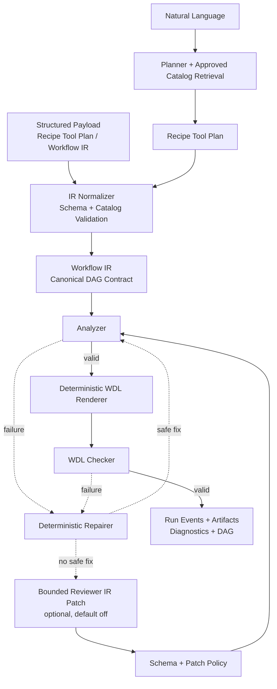
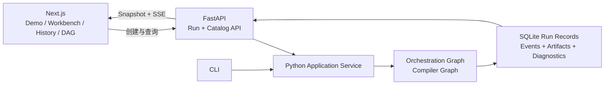

# AI-bioworkflow

将自然语言或结构化生信需求转换为 Catalog-bound Recipe Tool Plan 与 Workflow IR，再确定性编译成经验证的 WDL 1.0。

[在线 RNA-seq 示例](https://yuanzhw.com/workspace?example=rnaseq-deg) · [Run 历史](https://yuanzhw.com/runs) · [Catalog](https://yuanzhw.com/catalog) · [API 文档](https://yuanzhw.com/docs) · [90 秒演示分镜](./docs/portfolio-demo-script.md)

[](https://www.python.org/)
[](https://github.com/openwdl/wdl)
[](https://github.com/astral-sh/uv)
[](https://github.com/yuanzhw/AI-bioworkflow/actions/workflows/ci.yml)
[](./LICENSE)

LLM 只在显式结构化边界内承担自然语言规划和可选的 Reviewer IR 修复；Catalog 约束 recipe、tool、command 与 runtime container。Workflow IR（包括应用 Reviewer patch 后的候选）必须通过 Analyzer，再由确定性 Renderer 生成 WDL；Checker 只校验生成结果。Next.js 工作台记录同一次 run 的 timeline、artifacts、diagnostics 与 Workflow IR DAG，便于审阅和失败回放。


## 架构边界



Reviewer 不能生成 WDL、修改 Catalog、command template 或 runtime image；被接受的 patch 也必须重新通过完整编译链。公开结构化 demo 不依赖 Planner 或 Reviewer API key。

## 产品界面

**Workflow IR DAG：** 展示 inputs、scatter、calls、outputs、依赖边和 Catalog 声明的 runtime，表达编译时结构，不冒充真实任务执行状态。


**Catalog boundary：** 区分正式准入与执行验证状态，并把工具 schema、命令模板和容器来源留在后端 Catalog 内。


## 当前完成状态

- **规划与检索**：自然语言入口先检索 approved Catalog，再生成 Recipe Tool Plan；结构化入口可绕过 Planner。
- **确定性编译**：canonical `workflow.steps`、Analyzer、deterministic repair、WDL Renderer 和 Checker 已形成闭环。
- **有界 Reviewer**：P2 已实现 Analyzer / Checker 失败路由、IR patch policy、完整重校验、尝试预算和可回放 artifacts；默认禁用。
- **可观测工作台**：FastAPI + SQLite + SSE + Next.js 已覆盖 run 创建、历史、DAG、diagnostics、失败回放和 Catalog 边界。
- **部署状态**：公开 demo 已上线；execution backend 抽象、Cromwell contract tests 与 tiny e2e 已具备，但公开 demo 的真实执行后端保持禁用。
- **明确边界**：当前没有登录、多租户、配额或 API rate limit；长期保存和更高并发需迁移 PostgreSQL 或制定重置策略。

## ✨ 核心特性

- **Workflow IR 驱动**：将 workflow 调用关系与 task 定义分离，支持多个 task、复用 task、scatter 和明确的数据依赖。
- **确定性 WDL 编译**：通过 Jinja2 Renderer 从 IR 生成 WDL，避免让 LLM 承担模板引擎职责。
- **静态分析**：在渲染前检查 task/call 引用、输入完整性、上游输出引用和基础类型匹配。
- **Recipe / Tool Catalog**：支持用预定义生信工具目录和分析配方生成 Workflow IR。
- **受控 Agent 边界**：基于 LangGraph 串联 Planner、IR Normalizer、Analyzer、Repairer、可选 Reviewer、Renderer 与 Checker；模型只能返回显式 schema 约束的计划或 IR patch。
- **可复用服务与 API**：CLI 与 FastAPI 复用同一套 workflow/catalog service，避免界面层复制编译逻辑。
- **执行后端边界**：提供可配置的 Execution Backend 抽象和 Cromwell REST client，用 contract tests 覆盖提交、轮询、outputs/metadata 与失败语义。
- **Run history 与 DAG 审阅**：Next.js 工作台接入真实 run snapshot、SSE 时间线、历史详情、Workflow IR DAG 和失败 run 回放。
- **模块化设计**：State、Prompts、Nodes、Catalog、application service 与 API/UI 边界彼此独立，便于单元测试和契约验证。

## 🛠️ 快速开始

### 1. 环境准备

确保你的本地开发环境已安装以下基础工具：
- Python 3.13+
- [uv](https://github.com/astral-sh/uv) (极速的 Python 包管理器)
- Java 17+（WOMtool 92 需要 Java 17 或更新版本）

### 2. 克隆与安装

```bash
# 克隆仓库
git clone https://github.com/yuanzhw/AI-bioworkflow.git
cd AI-bioworkflow

# 使用 uv 同步依赖并创建虚拟环境
uv sync

# Windows / 本地校验环境：下载项目本地 Java 与 WOMtool
powershell -ExecutionPolicy Bypass -File scripts/install_java.ps1
powershell -ExecutionPolicy Bypass -File scripts/install_womtool.ps1
```

### 3. 配置环境变量

自然语言规划入口需要 DeepSeek API Key。确定性的 `--input` 结构化编译模式不需要 API Key。
可在项目根目录下创建 `.env` 文件，并填入 DeepSeek API 密钥。**请务必不要将此文件提交到版本控制系统中！**

```env
# .env 文件内容
DEEPSEEK_API_KEY="sk-你的真实API密钥"

# 可选：仅当工具不在默认 .cache 路径时需要设置
WOMTOOL_JAR="D:/path/to/womtool.jar"
JAVA_HOME="D:/path/to/jdk-17"
```

### 4. 常用操作入口

本地开发最常用的入口如下。默认 P0 检查不会触发真实 Cromwell e2e。

```powershell
# 本地 P0 快速检查：单测 + 代表性 WDL 编译/语法校验
powershell -ExecutionPolicy Bypass -File scripts\check_p0.ps1

# 启动本地 API + Web 开发服务
powershell -ExecutionPolicy Bypass -File scripts\dev_local.ps1

# 结构化 Recipe Tool Plan 编译
uv run main.py --input examples/rnaseq_deg_recipe_plan.json --output outputs/rnaseq_deg.wdl

# ChIP-seq compile-ready 示例（工具执行状态仍为 unverified）
uv run main.py --input examples/chipseq_peak_calling_recipe_plan.json --output outputs/chipseq_peaks.wdl

# 自然语言规划并编译
uv run main.py --prompt-file examples/rnaseq_deg_request.txt --output outputs/rnaseq_deg.wdl

# 启动 FastAPI 开发服务
.\.venv\Scripts\python.exe -m src.api.server
```

真实 Cromwell tiny e2e 需要显式 opt-in，并会委托
`scripts\run_cromwell_tiny_e2e.ps1` 完成 fixture 准备、runner 同步和测试执行：

```powershell
powershell -ExecutionPolicy Bypass -File scripts\check_p0.ps1 `
  -RunE2E `
  -CromwellUrl http://localhost:8000 `
  -WindowsFixtureRoot C:\data\ai-bioworkflow-tiny `
  -CromwellFixtureRoot /data/ai-bioworkflow-runner/tiny
```

### 5. 编译工作流

无参数运行时会使用内置自然语言 demo，先规划成 Recipe Tool Plan，再编译并打印生成的 WDL：

```bash
uv run main.py
```

也可以直接传入自然语言需求：

```bash
uv run main.py --prompt "做一个 bulk RNA-seq 差异表达分析流程，输入多个样本的双端 FASTQ、样本 ID、Salmon index、tx2gene 和样本分组表，先 fastp，再 salmon，然后 tximport、DESeq2 和 MultiQC。"
```

或者从文本文件读取需求并写出 WDL：

```bash
uv run main.py --prompt-file examples/rnaseq_deg_request.txt --output outputs/rnaseq_deg.wdl
```

结构化 JSON/YAML 输入仍然保留为开发/调试模式：

```bash
uv run main.py --input examples/rnaseq_deg_recipe_plan.json --output outputs/rnaseq_deg.wdl
```

常用选项：

- `--prompt`：读取自然语言 workflow 需求。
- `--prompt-file`：从文本文件读取自然语言 workflow 需求。
- `--input` / `-i`：开发模式，读取标准 Workflow IR 或 Recipe Tool Plan。
- `--output` / `-o`：写出生成的 WDL；不传则打印到终端。
- `--print-plan`：打印自然语言 Planner 生成的结构化 Recipe Tool Plan。
- `--save-plan`：将自然语言 Planner 生成的 Recipe Tool Plan 保存为 JSON 文件。
- `--save-planner-prompt`：保存完整 Planner prompt，方便调试模型输出。
- `--print-ir`：打印 Planner 标准化后的 Workflow IR。
- `--no-check`：跳过 WDL 语法校验，仅执行 IR 分析与 WDL 渲染。
- `--planner-model`：指定自然语言 Planner 使用的模型。
- `--verbose`：将节点进度日志输出到 stderr。

默认情况下，CLI 会把 WDL / JSON IR 等机器可消费内容写到 stdout，将状态、错误和校验信息写到 stderr，因此可以直接重定向生成 WDL：

```bash
uv run main.py --input examples/rnaseq_workflow_ir.json --no-check > workflow.wdl
```

调试自然语言规划时，可以保存模型看到的 prompt 和模型生成的 plan：

```bash
uv run main.py \
  --prompt-file examples/rnaseq_deg_request.txt \
  --save-planner-prompt debug/planner_prompt.txt \
  --save-plan debug/plan.json \
  --output outputs/rnaseq_deg.wdl
```

### 6. 启动 FastAPI 开发服务

如果本地同时运行 Cromwell server，建议保留 Cromwell 使用 `8000` 端口，本项目 FastAPI 开发服务使用 `8010` 端口，避免两个服务的 `/api/...` 路径互相混淆。

本地同时观察 API 与 Web 工作台时，可以使用联合开发脚本：

```powershell
powershell -ExecutionPolicy Bypass -File scripts\dev_local.ps1
```

该脚本默认启动 FastAPI `127.0.0.1:8010` 与 Next.js `127.0.0.1:3000`，并支持 `-ApiOnly`、`-WebOnly`、`-ApiPort` 和 `-WebPort`。

```powershell
.\.venv\Scripts\python.exe -m src.api.server
```

默认地址：

```text
http://127.0.0.1:8010/docs
```

如需临时覆盖端口：

```powershell
$env:AI_BIOWORKFLOW_API_PORT = "8020"
.\.venv\Scripts\python.exe -m src.api.server
```

### 7. 启动 Web 工作台与历史回放

前端位于 `web/`，作为独立的 Next.js 应用运行。`/workspace?example=rnaseq-deg`
的“运行示例”会调用 FastAPI `POST /api/compile`，订阅 SSE 事件流，并轮询 run snapshot
显示 Plan、Workflow IR、WDL、Diagnostics 和失败摘要。`/runs` 会读取持久化 run history，
`/runs/[runId]` 可以刷新回放同一次 run 的 timeline、artifacts、diagnostics 和 Workflow IR DAG。
本地演示时需要分别启动 FastAPI 和 Next.js。前端默认读取本地 FastAPI：

```text
http://127.0.0.1:8010
```

首次运行前安装前端依赖：

```powershell
cd web
npm install
```

启动开发服务：

```powershell
npm run dev
```

常用演示入口：

- `http://127.0.0.1:3000/workspace?example=rnaseq-deg`
- `http://127.0.0.1:3000/runs`
- `http://127.0.0.1:3000/catalog`

如果后端 API 地址不同，复制 `web/.env.example` 为 `web/.env.local` 并调整：

```env
NEXT_PUBLIC_API_BASE_URL=http://127.0.0.1:8010
```

如果 Next.js 开发服务不在默认 `3000` 端口运行，也需要让 FastAPI 允许对应来源：

```powershell
$env:AI_BIOWORKFLOW_CORS_ORIGINS = "http://127.0.0.1:3001,http://localhost:3001"
.\.venv\Scripts\python.exe -m src.api.server
```

## 📥 支持的输入格式

面向用户的主要入口是自然语言。系统会先用 LLM Planner 将需求转成结构化 Recipe Tool Plan，然后交给确定性编译链路处理。

结构化输入用于开发、调试和集成测试，目前支持两类：

1. **标准 Workflow IR**：提供 canonical `workflow.steps` 和 `tasks`，适合精确控制每个 task 的命令、输入、输出、scatter 和 runtime；旧版 calls-only 输入仍兼容，但 `workflow.calls` 只作为自动生成的扁平兼容视图。
2. **Recipe Tool Plan**：提供 `workflow.recipe` 和 `workflow.tool_calls`，由内置 recipe/tool catalog 自动解析为 Workflow IR。

Recipe Tool Plan 示例：

```json
{
  "workflow": {
    "name": "RNASeqDEG",
    "recipe": "rnaseq_differential_expression",
    "inputs": {
      "sample_ids": "Array[String]",
      "raw_r1s": "Array[File]",
      "raw_r2s": "Array[File]",
      "transcriptome_index": "File",
      "tx2gene": "File",
      "sample_groups": "File"
    },
    "tool_calls": [
      {
        "id": "qc",
        "step": "qc",
        "tool": "fastp",
        "version": "1.3.3",
        "inputs": {
          "r1": "raw_r1s",
          "r2": "raw_r2s"
        },
        "params": {
          "thread": 4
        }
      }
    ]
  }
}
```

`tool_calls[].inputs` 的值既可以是单个表达式字符串，也可以是表达式数组。数组会被编译成 WDL `Array[...]` 输入；例如 MultiQC 的 `report_files` 可以写成 `["qc.html_report", "qc.json_report", "quantify.log_file"]`，scatter 内产生的多个 `Array[File]` 会在渲染时自动展开为 `flatten([...])`。Catalog output 也可以用 `tags: [multiqc_input]` 标记可汇总文件；MultiQC 未显式提供 `report_files` 时会自动收集前序带标签输出。

## 🏗️ 架构与开发指南

上方流程图是当前真实编译链：自然语言和结构化输入最终共享 Workflow IR、
Analyzer、Renderer 与 Checker；deterministic repair 优先于可选 Reviewer，任何模型
修复都不能越过 IR patch policy 或完整重校验。

Web 层与编译器核心通过显式 API 和 application service 隔离：



关键边界：

- LLM Planner 只把自然语言需求规划为 Recipe Tool Plan；可选 Reviewer 只提出受 policy 约束的 Workflow IR patch，两者都不能直接生成最终 WDL。
- FastAPI 与 CLI 复用 Python application service；API 不通过 shell 调用 CLI。
- Next.js 只提交请求并展示 API 返回的事件和产物，不生成或修复 Plan、Workflow IR 或 WDL。
- DAG 从 Workflow IR 派生，用于审阅 step、scatter 和依赖关系，不表示真实 workflow call 的运行状态。

对于希望了解底层实现、LangGraph 状态图设计或参与二次开发的工程师，请阅读：

👉 **[查看 DEVELOPMENT.md 开发指南](./DEVELOPMENT.md)**

Workflow IR 的结构、表达式规则、scatter 语义和 WDL 后端映射详见：

👉 **[Workflow IR 规范与后端映射](./docs/workflow-ir.md)**

Web 产品化拆解与当前 W6 收口计划详见：

👉 **[W4 工作台工作拆解](./docs/w4-workbench-plan.md)**

👉 **[W5 DAG 与历史详情工作拆解](./docs/w5-dag-history-plan.md)**

👉 **[W6 部署与作品集打磨工作拆解](./docs/w6-portfolio-launch-plan.md)**

部署拓扑、环境变量、CORS、SQLite 数据边界和回滚流程详见：

👉 **[部署与运维手册](./docs/deployment.md)**

PR 必需检查、WOMtool / miniwdl 分工和本地等价命令详见：

👉 **[CI 与合并门禁](./docs/ci.md)**

## 🤝 参与贡献与治理

欢迎提交可复现的 bug、文档改进、测试、Recipe / Tool Catalog 扩展和聚焦的功能建议。
开始前请阅读 [贡献指南](./CONTRIBUTING.md)。社区行为、安全报告和维护决策分别遵循
[行为准则](./CODE_OF_CONDUCT.md)、[安全策略](./SECURITY.md) 与
[维护者治理](./MAINTAINERS.md)。

## 📅 未来路线图 (Roadmap)

- [x] 搭建基础 LangGraph 状态机。
- [x] 实现从结构化 JSON 到 WDL 的单向代码生成。
- [x] 引入 WOMtool 作为 Tool 节点，实现生成的 WDL 自动化本地校验。
- [x] 引入 Workflow IR、静态分析器与确定性 WDL Renderer。
- [x] 接入 Recipe / Tool Catalog 输入到 LangGraph Planner。
- [x] 闭环修复机制初版：当分析器或校验器发现可确定修复的问题时，优先修复 IR 并重新编译 WDL。
- [x] 完成 [P2 Reviewer IR 修复闭环](./docs/p2-reviewer-repair-plan.md)：Analyzer / Checker 失败在确定性修复无安全动作后进入有界 Reviewer 分支，结构化 patch 经过 policy 与完整编译链验证，并通过 run events、artifacts 和 diagnostics 回放。
- [x] Tool Catalog 强制显式声明 `runtime.docker`，作为镜像来源的唯一权威。
- [x] 支持 `workflow.steps` 与 WDL scatter，RNA-seq DEG recipe 升级为多样本 Salmon -> tximport -> DESeq2 -> MultiQC。
- [x] 抽取 workflow/catalog application service，供 CLI 与 API 复用。
- [x] 完成 W1 FastAPI 基础接口：自然语言 run、结构化 compile、recipe/tool catalog 查询。
- [x] 增加 Execution Backend 抽象、Cromwell REST backend contract tests 和 disabled 默认后端。
- [x] 增加 Cromwell Compose runner 文档、tiny RNA-seq fixture 生成脚本和显式 opt-in 的真实 e2e 入口。
- [x] 在独立 Cromwell runner 上手动跑通真实 RNA-seq tiny e2e。
- [x] 增加 P0 快速检查脚本，默认覆盖单测和代表性 WDL 编译/校验。
- [x] 记录一份可复现的 [Cromwell e2e 验证摘要](./docs/p0-e2e-verification.md)，包括 workflow id、最终状态和 output keys。
- [x] 增加正式 ChIP-seq peak-calling recipe，并建立带 workflow-family 指标的跨领域 RAG baseline。
- [x] 实现 W2 run 事件、SQLite 展示级持久化和 SSE 事件流。
- [x] 完成 W4 工作台：结构化示例 / 自然语言 run 创建、snapshot 轮询、SSE 时间线、Plan / IR / WDL / Diagnostics tabs 和失败态展示。
- [x] 完成 [W5 DAG 可视化和历史详情页](./docs/w5-dag-history-plan.md)：真实 run 列表、详情回放、Workflow IR DAG、结构状态和失败 run 摘要。
- [x] 完成 [W6 部署与作品集打磨](./docs/w6-portfolio-launch-plan.md)：在线 demo、稳定示例、架构图、截图、演示分镜、部署文档与 README 导航。
- [ ] 完成 P3 Architect 与 Bioinfo Reviewer 分层：Architect 负责候选分析方案，Bioinfo Reviewer 只读输出科学性 warnings。
- [ ] 扩展更多常用生信 recipe 与 tool catalog。

## 📄 许可证

[Apache License 2.0](./LICENSE)
