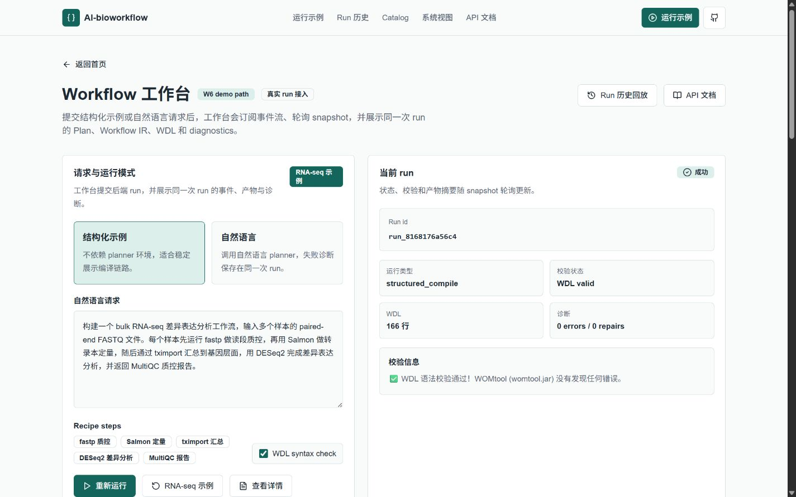
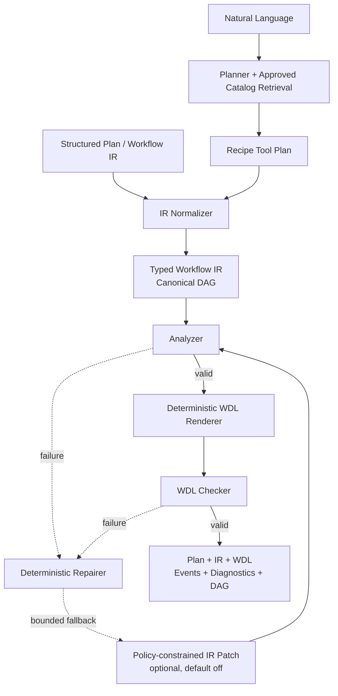
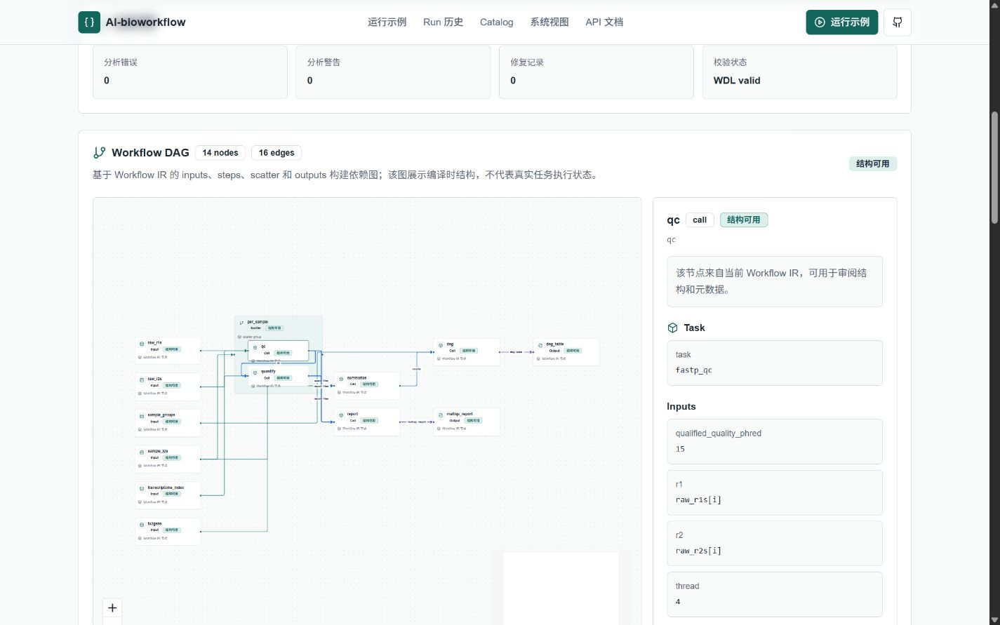
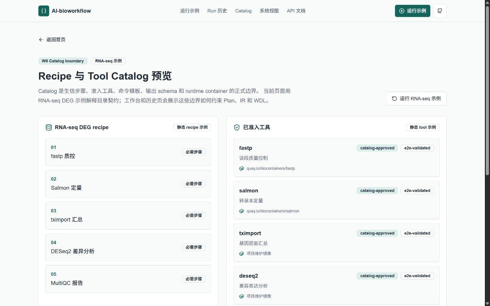

# AI-bioworkflow

[中文](./README.md) · **[English](./README.en.md)**

将自然语言或结构化生信需求约束为 Recipe Tool Plan 和 Workflow IR，再由确定性编译器生成并验证 WDL 1.0。

**English TL;DR:** An auditable bioinformatics workflow compiler that constrains LLM planning to a Catalog-backed plan, validates a typed Workflow IR, and deterministically renders WDL 1.0. The public demo exposes plans, diagnostics, artifacts, and DAGs; it does not claim that compilation is equivalent to real execution. **[Read the English overview →](./README.en.md)**

[在线 RNA-seq 示例](https://yuanzhw.com/workspace?example=rnaseq-deg) · [RNA-seq 案例证据链](./docs/rnaseq-case-study.md) · [Run 历史](https://yuanzhw.com/runs) · [Catalog](https://yuanzhw.com/catalog) · [API 文档](https://yuanzhw.com/docs)

[](https://www.python.org/)
[](https://github.com/openwdl/wdl)
[](https://github.com/yuanzhw/AI-bioworkflow/actions/workflows/ci.yml)
[](./LICENSE)



## 为什么做这个项目

让模型直接输出工作流代码很快，但难以保证工具版本、输入输出、容器来源和修复过程可审计。AI-bioworkflow 把不确定性限制在显式结构化接口中：

- **模型负责规划，不负责写最终 WDL。** 自然语言先变成带 schema 的 Recipe Tool Plan；结构化入口可以完全绕过模型和 API key。
- **Catalog 是工具与运行时的权威来源。** recipe、tool、version、command、parameter 和 container 都必须通过正式 Catalog 校验，编译器不会猜测或静默替换镜像。
- **编译与验证保持确定性。** Workflow IR 先经 Analyzer 检查，再由 Python/Jinja2 Renderer 生成 WDL；WOMtool 92 是与 Cromwell 92 对齐的主校验器。
- **失败和修复可以回放。** 可选 Reviewer 只能提出受 policy 约束的 IR patch；任何 patch 都要重新通过 Analyzer、Renderer 和 Checker。

## 架构边界



`workflow.steps` 是 canonical DAG；`workflow.calls` 只保留为旧版扁平输入的兼容视图。CLI、FastAPI 和 Next.js 工作台复用同一 application service，界面层不会复制规划或编译逻辑。

## 一条可追溯的 RNA-seq 路径

仓库提供 bulk RNA-seq 差异表达案例，覆盖 `fastp → Salmon → tximport → DESeq2 → MultiQC`：

| 阶段 | 可检查的公开证据 |
| --- | --- |
| 原始需求 | [`examples/rnaseq_deg_request.txt`](./examples/rnaseq_deg_request.txt) |
| 结构化计划 | [`examples/rnaseq_deg_recipe_plan.json`](./examples/rnaseq_deg_recipe_plan.json) |
| Recipe 与工具约束 | [`src/recipes/definitions/rnaseq_differential_expression.yaml`](./src/recipes/definitions/rnaseq_differential_expression.yaml) 与 [`src/catalog/tools/`](./src/catalog/tools/) |
| 编译与校验 | [required CI gate](./docs/ci.md) 与 [`tests/`](./tests/) |
| 独立执行证据 | [四样本 Cromwell tiny E2E 记录](./docs/cromwell-tiny-e2e-verification.md) |

完整的输入、DAG、复现命令、预期输出和证据边界见 **[RNA-seq 案例研究](./docs/rnaseq-case-study.md)**。

## 快速验证

### 在线体验

打开[预置 RNA-seq 工作台](https://yuanzhw.com/workspace?example=rnaseq-deg)，运行结构化示例即可查看 Recipe Tool Plan、Workflow IR、WDL、diagnostics、事件时间线和 DAG。该路径不需要调用自然语言 Planner。

公开实例用于编译和审阅演示，真实 execution backend 默认禁用；页面中的成功状态表示编译链和 WDL 校验成功，不表示云端已运行生信工具。

### 本地确定性编译（无需 API key）

要求 Python 3.13+、[`uv`](https://github.com/astral-sh/uv) 和 Java 17+。在 Windows PowerShell 中：

```powershell
git clone https://github.com/yuanzhw/AI-bioworkflow.git
cd AI-bioworkflow
uv sync --locked

powershell -ExecutionPolicy Bypass -File scripts/install_java.ps1
powershell -ExecutionPolicy Bypass -File scripts/install_womtool.ps1
$env:WDL_VALIDATOR = "womtool"
$env:WOMTOOL_JAR = (Resolve-Path ".cache\womtool\womtool-92.jar").Path

uv run --locked main.py `
  --input examples/rnaseq_deg_recipe_plan.json `
  --output .cache/demo/rnaseq_deg.wdl
```

在 Linux、macOS 或 WSL 上可以运行生产兼容校验路径：

```bash
uv sync --locked --extra miniwdl
WDL_VALIDATOR=miniwdl uv run --locked --extra miniwdl \
  main.py --input examples/rnaseq_deg_recipe_plan.json \
  --output .cache/demo/rnaseq_deg.wdl
uv run --locked --extra miniwdl miniwdl check .cache/demo/rnaseq_deg.wdl
```

WOMtool 92 是 canonical CI validator，miniwdl 是生产镜像的第二实现兼容检查；版本、校验和与完整本地门禁命令见 [CI 文档](./docs/ci.md)。

### 自然语言规划（需要 API key）

```bash
uv run main.py \
  --prompt-file examples/rnaseq_deg_request.txt \
  --save-plan .cache/demo/plan.json \
  --print-ir \
  --output .cache/demo/rnaseq_deg.wdl
```

自然语言入口需要 `DEEPSEEK_API_KEY`。不要提交 `.env`、API key、患者数据、受控访问数据或私有运行日志。

## 产品展示

**Workflow IR DAG** 展示 inputs、scatter、calls、outputs、依赖边和 Catalog runtime。它表达编译结构，不冒充真实 task 状态。



**Catalog boundary** 把“正式准入”与“执行验证”分开记录，同时保留 schema、命令模板、容器和 evidence。



## 当前能力与限制

| 能力 | 当前状态 |
| --- | --- |
| Recipe Tool Plan / Workflow IR → WDL 1.0 | 已实现；确定性生成并有单元、集成和代表性 WDL 校验覆盖 |
| 自然语言 → Catalog-bound plan | 已实现；需要外部模型 API key |
| Analyzer / deterministic repair / bounded Reviewer | 已实现；Reviewer 默认禁用且只能修复 IR |
| FastAPI、SQLite run history、SSE、Next.js DAG 工作台 | 已实现并提供公开 demo |
| PR 合并门禁 | `CI gate` 强制运行 Python、WOMtool、miniwdl 与 Web 检查 |
| 真实工作流执行 | 有 Cromwell backend contract tests 和独立 tiny E2E 证据；公开 demo 默认禁用 |
| 生产级平台能力 | 当前没有登录、多租户、配额、rate limit 或高可用承诺 |

WDL 通过语法/类型校验并不证明某个分析方案适合任意研究设计，也不证明每次编译都已执行。工具运行证据通过 Catalog 的 `execution_verification` 独立表达。

## 状态与路线图

- **Released:** [`v0.1.0-alpha.2`](https://github.com/yuanzhw/AI-bioworkflow/releases/tag/v0.1.0-alpha.2) 在公开编译工作台基础上补齐 WOMtool 92 required CI、OSS 治理、双语入口与可追溯案例。
- **Current `main`:** ChIP-seq compile-ready recipe、跨 workflow-family 检索评测与公共证据页已纳入持续演进基线。
- **Next:** 分层 Architect / Bioinfo Reviewer、更多正式 recipe/tool，以及对检索质量和科学性 warning 的可复现评测。
- **当前不做:** 让模型直接生成最终 WDL、在公开 demo 默认开启真实执行，或为了展示提前建设登录、计费和复杂多租户平台。

详细设计与阶段记录保留在 [DEVELOPMENT.md](./DEVELOPMENT.md) 和 [`docs/`](./docs/)，不再在 README 复制内部 checklist。版本变化见 [CHANGELOG.md](./CHANGELOG.md)。

## 文档导航

| 文档 | 用途 |
| --- | --- |
| [RNA-seq 案例研究](./docs/rnaseq-case-study.md) | 从需求、Plan、IR、WDL 校验到独立 E2E evidence 的可追溯案例 |
| [Workflow IR 规范](./docs/workflow-ir.md) | schema、表达式、scatter 和 WDL backend 映射 |
| [开发与架构指南](./DEVELOPMENT.md) | 模块边界、状态图和后续设计 |
| [CI 与合并门禁](./docs/ci.md) | WOMtool / miniwdl 分工、required check 与本地命令 |
| [部署与运维](./docs/deployment.md) | Compose 拓扑、配置边界、回滚和生产限制 |
| [测试用例](./docs/test-cases.md) | fixture、预期行为和覆盖意图 |
| [支持说明](./SUPPORT.md) | 问题反馈范围、所需信息与安全分流 |

## 参与贡献

欢迎提交可复现 bug、文档改进、测试、Recipe / Tool Catalog 扩展和聚焦的功能建议。请先阅读 [贡献指南](./CONTRIBUTING.md)；社区行为、安全报告和维护决策分别遵循 [行为准则](./CODE_OF_CONDUCT.md)、[安全策略](./SECURITY.md) 与 [维护者治理](./MAINTAINERS.md)。

## 许可证

[Apache License 2.0](./LICENSE)
