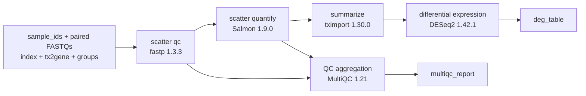

# RNA-seq case study: an auditable path from requirement to WDL

[Project overview](../README.en.md) · [中文项目首页](../README.md) · [Open the live example](https://yuanzhw.com/workspace?example=rnaseq-deg)

This case study follows one bulk RNA-seq differential-expression request through the repository's public contracts: a Recipe Tool Plan, Catalog resolution, canonical Workflow IR, static analysis, deterministic WDL rendering, and syntax/type validation.

> **Compilation and WDL validation are not real execution.** A successful public-demo run establishes that the structured compiler path completed and the generated WDL passed its configured checker. Real tool execution is a separate claim with separate evidence.

## 中文摘要

本案例使用仓库中已跟踪的 RNA-seq request、Recipe Tool Plan、recipe/tool Catalog、测试和 CI，展示 `fastp → Salmon → tximport → DESeq2 → MultiQC` 如何被解析成 Workflow IR 并确定性编译为 WDL 1.0。公开 demo 的成功状态只代表编译和 WDL 校验成功；真实执行证据来自另一次显式启用的四样本 Cromwell tiny E2E，不能混为一谈。

## 1. The requirement

The tracked [natural-language request](../examples/rnaseq_deg_request.txt) asks for:

- multiple sample identifiers and paired-end FASTQ files;
- a Salmon transcriptome index;
- transcript-to-gene and sample-group tables;
- per-sample quality control and quantification;
- gene-level summarization, differential expression, and a QC report;
- a differential-expression table and MultiQC report as workflow outputs.

Natural-language planning is not required to reproduce this case. The corresponding [structured Recipe Tool Plan](../examples/rnaseq_deg_recipe_plan.json) is checked into the repository and can enter the deterministic compiler directly without an API key.

## 2. The Catalog-constrained plan

The plan names a formal [`rnaseq_differential_expression` recipe](../src/recipes/definitions/rnaseq_differential_expression.yaml) and five exact tool versions:

| Plan step | Tool contract | Data role | Current execution evidence |
| --- | --- | --- | --- |
| `qc` | [`fastp` 1.3.3](../src/catalog/tools/fastp/1.3.3.yaml) | Trim and quality-check each FASTQ pair | `e2e-validated` |
| `quantify` | [`salmon` 1.9.0](../src/catalog/tools/salmon/1.9.0.yaml) | Quantify transcripts for each sample | `e2e-validated` |
| `summarize` | [`tximport` 1.30.0](../src/catalog/tools/tximport/1.30.0.yaml) | Build a gene-level count matrix | `e2e-validated` |
| `deg` | [`deseq2` 1.42.1](../src/catalog/tools/deseq2/1.42.1.yaml) | Estimate differential expression | `e2e-validated` |
| `report` | [`multiqc` 1.21](../src/catalog/tools/multiqc/1.21.yaml) | Aggregate QC artifacts | `e2e-validated` |

Each Tool Catalog file declares its input/output schemas, parameters, command template, runtime container, and execution-verification evidence. Catalog admission and execution verification remain separate fields: a tool cannot gain an `e2e-validated` claim merely by compiling successfully.

The recipe constrains both step roles and allowed tools. For example, the differential-expression step may resolve to DESeq2, edgeR, or limma-voom only when the selected tool has a formal Catalog definition; this case explicitly selects DESeq2.

## 3. The canonical DAG

Catalog resolution normalizes the plan into the typed Workflow IR described by the [Workflow IR specification](./workflow-ir.md). `workflow.steps` is the canonical DAG, including scatter structure and data dependencies.



The normalized IR is produced for every compile instead of relying on a hand-maintained generated snapshot. It is available as a named run artifact in the workbench and API. The resolver implementation lives in [`src/catalog/resolver.py`](../src/catalog/resolver.py), while static DAG, reference, and type checks live in [`src/analyzer.py`](../src/analyzer.py).


## 4. Deterministic WDL generation and validation

After Analyzer acceptance, [`src/renderers/wdl.py`](../src/renderers/wdl.py) and the tracked [Jinja2 template](../src/renderers/templates/workflow.wdl.j2) render WDL 1.0. The language model is not part of this IR-to-WDL step.

WOMtool 92 is the canonical CI validator because the execution runner targets Cromwell 92. miniwdl is a required second-implementation compatibility check for the production API image. Their exact roles, pinned WOMtool checksum, and CI topology are documented in [CI and merge gate](./ci.md).

### Reproduce on Windows PowerShell

```powershell
uv sync --locked
powershell -ExecutionPolicy Bypass -File scripts/install_java.ps1
powershell -ExecutionPolicy Bypass -File scripts/install_womtool.ps1

$env:WDL_VALIDATOR = "womtool"
$env:WOMTOOL_JAR = (Resolve-Path ".cache\womtool\womtool-92.jar").Path
$env:JAVA_EXE = (Get-ChildItem ".cache\java" -Recurse -Filter java.exe |
  Where-Object { $_.FullName -match '\\bin\\java\.exe$' } |
  Select-Object -First 1).FullName

uv run --locked main.py `
  --input examples/rnaseq_deg_recipe_plan.json `
  --output .cache/case-study/rnaseq_deg.wdl

& $env:JAVA_EXE -jar $env:WOMTOOL_JAR validate .cache/case-study/rnaseq_deg.wdl
```

The CLI writes the generated WDL to `.cache/case-study/rnaseq_deg.wdl`; direct WOMtool validation should finish with `Success!`. The `.cache` path is intentionally untracked.

### Reproduce the secondary check on Linux, macOS, or WSL

```bash
uv sync --locked --extra miniwdl
WDL_VALIDATOR=miniwdl uv run --locked --extra miniwdl \
  main.py --input examples/rnaseq_deg_recipe_plan.json \
  --output .cache/case-study/rnaseq_deg.wdl
uv run --locked --extra miniwdl miniwdl check \
  .cache/case-study/rnaseq_deg.wdl
```

Native Windows is not a supported miniwdl environment because miniwdl imports POSIX-only modules; use WSL or the required Ubuntu CI job for that secondary check.

## 5. What the required CI proves

Every pull request reports a stable `CI gate` with no documentation-only bypass. For this case, [`.github/workflows/ci.yml`](../.github/workflows/ci.yml) performs the following independently of the public deployment:

1. installs the locked Python 3.13 environment;
2. verifies Java, the exact WOMtool 92 version, byte size, and SHA-256;
3. runs the complete Python test suite;
4. compiles the RNA-seq Recipe Tool Plan and validates the emitted WDL directly with WOMtool;
5. compiles representative plans again under miniwdl and runs an explicit `miniwdl check`;
6. runs Web lint, tests, and a production Next.js build.

Focused contracts for this path include Catalog resolution, Workflow IR analysis/rendering, CLI output, API artifacts, run persistence/events, execution policy, and Cromwell client behavior. The [test-case index](./test-cases.md) explains their coverage intent.


## 6. Separate real-execution evidence

The repository also records one explicitly enabled [Cromwell tiny E2E run](./cromwell-tiny-e2e-verification.md). That run is separate from the public compile demo and from the deterministic PR gate.

| Field | Recorded evidence |
| --- | --- |
| Validation date | 2026-06-14, Asia/Shanghai |
| Workflow | `RNASeqDEG` |
| Samples | `ctrl_1`, `ctrl_2`, `treat_1`, `treat_2` |
| Cromwell workflow ID | `1ea70de2-dee2-4da9-b7ab-e6ac25e1bdf8` |
| Final state | `Succeeded` |
| Expected calls | `qc`, `quantify`, `summarize`, `deg`, `report` |
| Returned outputs | `RNASeqDEG.deg_table`, `RNASeqDEG.multiqc_report` |

The evidence record includes the opt-in command, timestamps, output paths, and confirmation that both output files were non-empty. The reusable fixture and test entry points are tracked in [`examples/tiny/`](../examples/tiny/) and [`tests/e2e/test_tiny_run.py`](../tests/e2e/test_tiny_run.py).

This evidence establishes that the recorded tiny input completed on the documented Cromwell/Docker setup. It does **not** establish continuous production execution, benchmark performance, clinical validity, or successful execution for arbitrary data.

## Claim ledger

| Claim | Evidence | What it does not imply |
| --- | --- | --- |
| The input is accepted by formal project contracts | Tracked Recipe Tool Plan, recipe definition, Tool Catalog, resolver tests | The biological design is optimal for every study |
| The IR is structurally valid | Schema and Analyzer checks in the compiler/test suite | Referenced files exist on an execution backend |
| The generated source is valid WDL 1.0 | WOMtool 92 plus miniwdl compatibility checks | Containers have run for this particular compilation |
| The public run is reviewable | Stored Plan/IR/WDL/diagnostics/events and the DAG UI | The DAG displays live Cromwell task states |
| This workflow family has real execution evidence | Recorded four-sample tiny Cromwell E2E | Every commit or public-demo run executes tools |
| Tool definitions carry execution evidence | Per-tool `execution_verification` records | Unverified future tool versions inherit that evidence |

## Known limits and next questions

- The public demo has no authentication, multi-tenancy, quota, API rate limit, or availability commitment.
- SQLite run history is suitable for a single-instance portfolio deployment, not a horizontally scaled workflow service.
- Syntax/type validation cannot replace scientific review of cohort design, contrasts, covariates, batch effects, or quality thresholds.
- The current Bioinfo Reviewer roadmap is not presented as released behavior.
- Real execution remains explicitly opt-in and must go through the `src.execution` backend boundary.

For architecture details, see [DEVELOPMENT.md](../DEVELOPMENT.md). For a reproducible problem report, follow [SUPPORT.md](../SUPPORT.md); report vulnerabilities privately according to [SECURITY.md](../SECURITY.md).
